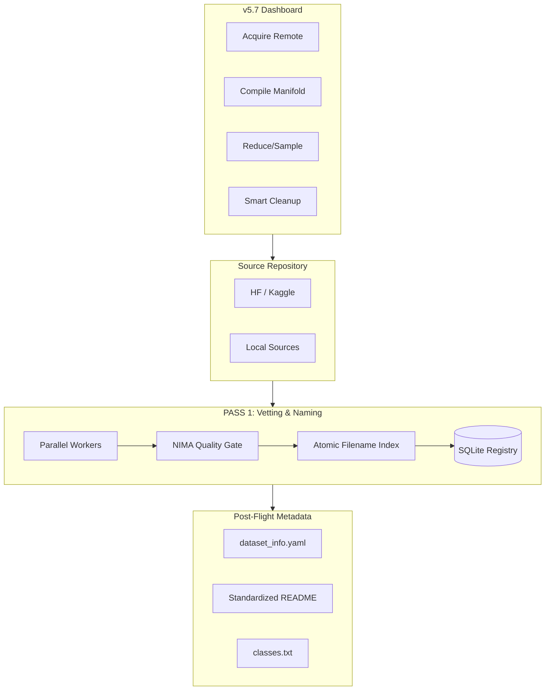

# LemGendary Dataset Pipeline (v5.7.0-SOTA)

> **The Industrial Standard for Generative & Vision Data Synthesis.**
>
> Elevate from static sharding to a **Self-Optimizing Generative Manifold**. Orchestrate massive-scale Diffusion and YOLO datasets with industrial-grade CLIP styling, multi-domain balancing, interactive dynamic compilation, and SQLite persistence.

---

## ⚡ v5.7 SOTA Tier: Full Lifecycle Orchestration

The v5.7 release transforms the pipeline into a complete **Dataset Lifecycle Manager**, adding high-speed sampling, dependency-aware cleanup, and strict metadata compliance for the LemGendary Training Suite.

### 🎯 Interactive Orchestrator Dashboard
- **Row-Based Navigation**: A modernized, high-density CLI menu in both Python and PowerShell.
- **[ACQUIRE] Logic**: Automated pulling of remote sources from Hugging Face and Kaggle directly into the `raw-sets/` buffer.
- **[REDUCE] Engine**: Instantly create downsampled "Mini" or "Targeted" manifold variants (e.g., 10k samples) from existing compiled datasets without re-vetting.
- **[CLEANUP] Guardian**: A smart deletion engine that verifies `unified_data.yaml` dependencies and manifold existence before allowing raw source purging.

### 💎 NIMA Aesthetic & Technical Standards
- **Naming Convention**: Enforces the mandatory `Model_SourceSet_000000000.jpg` format to prevent cross-source collisions in multi-tenant training.
- **Softmax Probability Vectors**: Labels now contain 10-bin quality distributions (Worst 1 -> Best 10) for EMD (Earth Mover's Distance) optimization.
- **Atomic Persistence**: Registry commits are now buffered every 1,000 samples to prevent SQLite journal bloat and stabilize I/O on large manifolds.

### 📄 Universal Metadata Compliance
Every compiled manifold now automatically generates a full LemGendary-compliant metadata package:
- **`dataset_info.yaml`**: Detailed stats, task type, and source provenance.
- **`category.txt` / `classes.txt`**: Standardized taxonomies for immediate training ingestion.
- **SOTA README**: Auto-generated manifests including performance benchmarks and Kaggle deployment schemas.

---

## 🏗️ v5.7 Synthesis Flow



---

## 🛠️ Developer Interface

### 1. The Dataset Hub (v5.7.0-SOTA)
Launch the modernized interactive dashboard:
```powershell
./lemgendary_datasets_hub.ps1
```

### 2. Manual Orchestration
The python engine now supports direct CLI hooks for automation:
```bash
python compiler-pipeline.py --model nima_aesthetic --max_gb 50 --suffix Large
python compiler-pipeline.py --reduce   # Start sampling engine
python compiler-pipeline.py --cleanup  # Start smart cleanup
```

---

## 📂 Industrial Output Topology
- `raw-sets/` (Source datasets - Protected by Cleanup Guardian)
- `LemGendizedDatasets/<name>/images/` (Standard structured folders)
- `LemGendizedDatasets/<name>/labels/` (10-bin probability vectors)
- `LemGendizedDatasets/<name>/dataset_info.yaml` (Suite Metadata)
- `LemGendizedDatasets/<name>/manifold_registry.db` (Persistent SQLite metadata)

---
**LemGendary AI Suite | Advanced Agentic Coding 2026**
