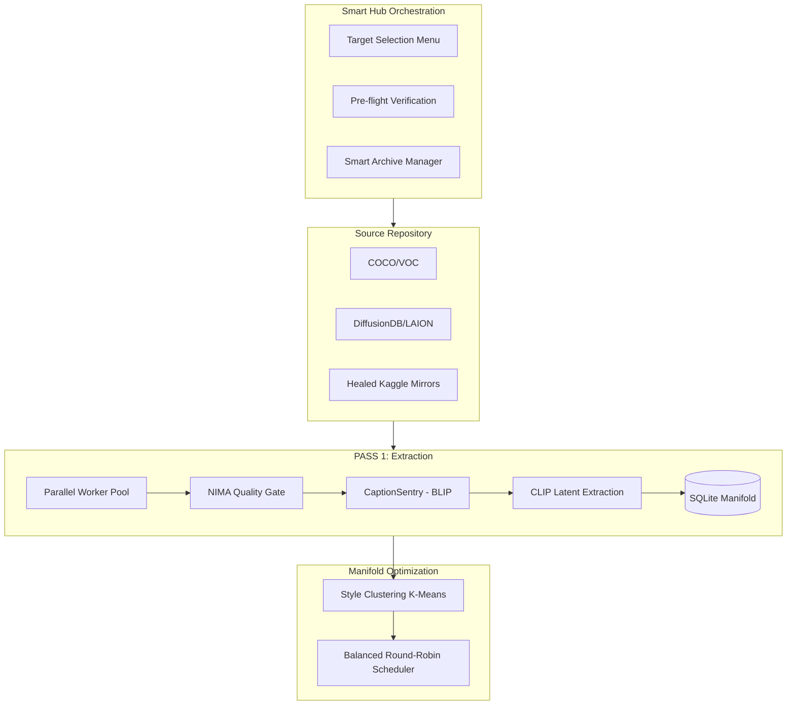

# LemGendary Dataset Pipeline (v5.2.0-LEMGENDARY)

> **The Industrial Standard for Generative & Vision Data Synthesis.**
>
> Elevate from static sharding to a **Self-Optimizing Generative Manifold**. Orchestrate massive-scale Diffusion and YOLO datasets with industrial-grade CLIP styling, multi-domain balancing, interactive dynamic compilation, and SQLite persistence.

---

## ⚡ v5.2 Ascension Tier: Smart Acquisition & Compilation

The v5.2 release introduces a revolutionary **Smart Hub Architecture**, enabling targeted acquisition, dynamic compilation constraints, and precision archive management.

### 🎯 Interactive Target Compilation
- **Targeted Execution**: The Hub script (`lemgendary_datasets_hub.ps1`) now allows users to precisely target specific dataset models (e.g., `nima_aesthetic`, `ultrazoom_x4`) or compile all sets globally.
- **Dynamic Constraints**: Enforce compilation boundaries on the fly. Input absolute maximum dataset limits and suffixes dynamically without hardcoding YAML configs.

### 🧠 Smart Archive Manager
A robust `archive_manager.py` utility completely overhauls the acquisition extraction phase.
- **Skipping & Verification**: Zips are automatically scanned for corruption. Valid archives natively bypass the Kaggle download phase.
- **Smart Extraction**: Scans the destination directory against the Zip metadata and only extracts missing files, preserving disk I/O and radically speeding up resumption logic.
- **Auto-Purge**: Flawless extractions automatically trigger the deletion of the source `.zip` archive to preserve drive capacity.

### 🧬 CLIP Style Manifold (StyleSentry)
Every image is semantically scanned using **CLIP (ViT-B/Patch32)**.
- **Style Clustering**: Automatically groups your dataset into visual clusters (e.g., Cinematic, Sketch, Anime) via *MiniBatchKMeans*.
- **Zero-Shot Style Tagging**: Injects descriptive style keywords into captions based on multimodal manifold proximity.

---

## 🏗️ v5.2 Synthesis Flow



---

## 🛠️ Developer Interface

### 1. The Dataset Hub (v5.2.0-LEMGENDARY)
Launch the globally hardened interactive dashboard:
```powershell
./lemgendary_datasets_hub.ps1
```
Follow the interactive prompts to target your `Acquire` or `Compile` operations.

### 2. Registry Controls (`unified_data.yaml`)
Establish structural baselines across your ecosystem:
```yaml
global_constraints:
  min_size_gb: 5.0
  max_size_gb: 150.0
```

---

## 📂 Industrial Output Topology
- `raw-sets/` (Raw multi-format sources)
- `compiled-datasets/<name>/images/` (Standard structured folders)
- `compiled-datasets/<name>/shards/` (Balanced .tar manifold)
- `compiled-datasets/<name>/manifold_registry.db` (Persistent SQLite metadata)
- `compiled-datasets/<name>/index.json` (The Master Manifest)

---
**LemGendary AI Suite | Advanced Agentic Coding 2026**
