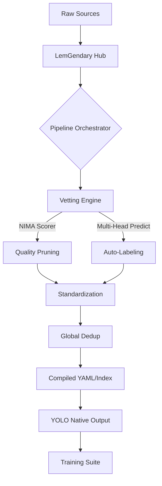

# LemGendary Dataset Pipeline (v2.6.0-SOTA)

> **Master the Chaos: Orchestrating world-class YOLO datasets with automated vetting, synthesis, and multitasking labels.**

The LemGendary Dataset Pipeline is a professional-grade synthesis engine that transforms raw imagery into production-ready datasets. Optimized for the 2026-era vision architectures, it features automated quality gates, synthetic label bootstrapping, and native support for complex multitasking training.

---

## 🚀 Pillars of Resilience

### 🤖 Multi-Task Vetting Engine
The system acts as an autonomous data scientist, auditing every image candidate:
- **NIMA Quality Sentry**: Transformer-based technical scoring. Automatically prunes "garbage" images below the 4.5 threshold.
- **YOLO Auto-Labeler**: Bootstraps missing labels for **Detection**, **Instance Segmentation**, and **Pose Estimation** by dynamically switching between specialized model heads.

### 🧠 Smart Sampler v2
Balanced data is the key to convergence. Our sampler provides geometric equalization across:
- **Classes**: Frequency-weighted category balancing.
- **Sources**: Normalized representation from multiple raw datasets.
- **Tasks**: Stratification between detection, segmentation, pose, and restoration objectives.

### 🔗 Greedy Format Layer (YOLO Native)
Direct consumption of professional research formats:
- **COCO & VOC**: Full extraction of boxes, polygons, and keypoints.
- **Parquet & MATLAB**: Greedy schema discovery for coordinates and class metadata.
- **Output**: Native YOLO format (`.txt`) with exact 6-decimal precision.

---

## 🛠️ System Architecture



## 📦 Engineering Standards
- **Global Deduplication**: Persistence-aware MD5 hashing checks against existing indices.
- **Consolidated Multi-Task Labels**: YOLO-compliant serialized labels for boxes, masks, and poses in a single unified `/labels` stream.
- **Atomic Extractions**: Serial Extraction Mutex ensures thread-safe data unzipping in high-concurrency environments.

---

## 🚦 Usage Guide

### 1. The Dataset Hub (Primary Orchestrator)
The central entry point for the entire repository:
```powershell
./lemgendary_hub.ps1
```
- 📥 **Acquire**: Parallel Kaggle downloads and automatic cleanup.
- ⚙️ **Compile**: Run the full synthesis and pruning pipeline.
- 📊 **Audit**: Real-time stats on image counts and NIMA quality distributions.

### 2. Manual Synthesis
For direct control over the compilation engine:
```bash
python compiler-pipeline.py
```

---

## 📁 Standardized Structure
After processing, datasets are exported to:
- `compiled-datasets/images/[train|val]`
- `compiled-datasets/labels/[train|val]`
- `compiled-datasets/targets/[train|val]` (Image-to-Image benchmarks)
- `compiled-datasets/index.json` (Full metadata index with multitask flags)

---

## 📊 SOTA Training Optimization
Compiled sets are pre-configured for:
- **Detection**: CIoU + Focal Loss optimization.
- **Segmentation**: Mask IoU / Boundary Loss convergence.
- **Pose**: OKS (Object Keypoint Similarity) standard.

---
**LemGendary AI Suite | Advanced Agentic Coding 2026**
