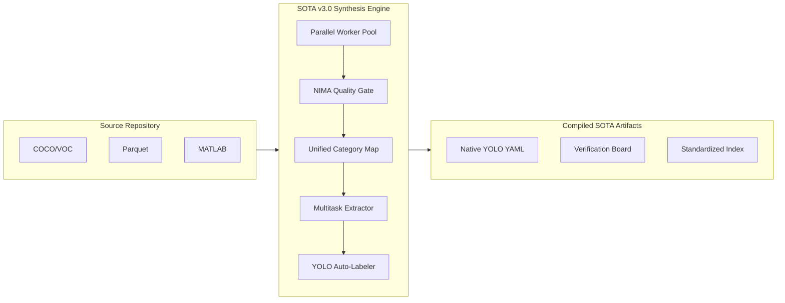

# LemGendary Dataset Pipeline (v3.0.0-LEMGENDARY)

> **The Industrial Standard for Vision Data Synthesis.**
>
> Orchestrate massive-scale YOLO datasets with hyper-parallel vetting, unified category mapping, and autonomous multitask bootstrapping.

---

## ⚡ 2026 Resilience Architecture

The v3.0 release transforms the pipeline from a sequential script into a distributed synthesis engine, designed for multi-million image datasets with strict quality and consistency requirements.

### 🧵 Massive Parallelism (ProcessPool)
The core compiler now utilizes all available CPU cores via `ProcessPoolExecutor`. Workers initialize high-precision NIMA and YOLO models once, enabling blistering throughput even with expensive quality vetting enabled.

### 🧬 Unified Category Mapping
Stop the class-ID fragmentation. Our system injects a global `category_map.json` (COCO-80 Baseline) into every parsing layer, ensuring that "Person" is always Class 0 and "Car" is always Class 2, regardless of the source format (COCO, OID, Parquet, or MATLAB).

### 🎭 Expanded Multitask DNA
Full, greedy discovery and extraction for professional research formats:
- **Instance Segmentation**: Deserializes complex polygon vertices.
- **Pose Estimation**: Extracts normalized keypoint arrays with visibility flags.
- **Auto-Bootstrapping**: Fills missing labels using task-specific YOLO heads (`-seg`, `-pose`).

---

## 🏗️ System Flow



---

## 🛠️ Developer Interface

### 1. The Dataset Hub
The master TUI for acquiring and compiling datasets.
```powershell
./lemgendary_datasets_hub.ps1
```

### 2. Manual Synthesis
Run the high-performance compiler directly.
```bash
# Leverages (CPU_CORES - 2) workers by default
python compiler-pipeline.py
```

### 3. Visual Verification (QA)
Audit the synthesis results with projected labels.
```bash
# Renders samples to /verification folder
python verify_labels.py
```

---

## 📂 Industrial Dataset Standards
Post-synthesis, assets are strictly organized for 2026-era vision loaders:
- `compiled-datasets/images/[train|val]`
- `compiled-datasets/labels/[train|val]` (0-1 Normalized, 6-decimal precision)
- `compiled-datasets/dataset.yaml` (Self-generating YOLO config)
- `compiled-datasets/index.json` (The Master Manifest)
- `verification/` (Burn-in samples for manual QA)

---
**LemGendary AI Suite | Advanced Agentic Coding 2026**
