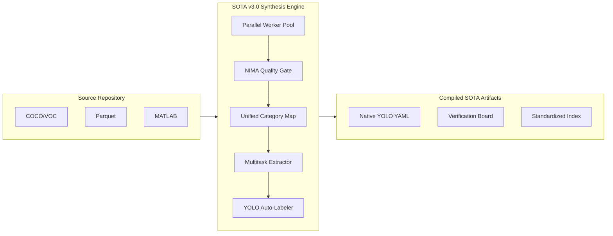

# LemGendary Dataset Pipeline (v3.0.0-LEMGENDARY)

> **The Industrial Standard for Vision Data Synthesis.**
>
> Orchestrate massive-scale YOLO datasets with hyper-parallel vetting, unified category mapping, and autonomous multitask bootstrapping.

---

## ⚡ 2026 Resilience Architecture

The v3.0 release transforms the pipeline from a sequential script into a distributed synthesis engine, designed for multi-million image datasets with strict quality and consistency requirements.

### 🧵 Massive Parallelism (ProcessPool)
The core compiler now utilizes all available CPU cores via `ProcessPoolExecutor`. Workers initialize high-precision NIMA and YOLO models once, enabling blistering throughput even with expensive quality vetting enabled.

### 🧬 Unified Category Mapping
Stop the class-ID fragmentation. Our system injects a global `category_map.json` (COCO-80 Baseline) into every parsing layer, ensuring that "Person" is always Class 0 and "Car" is always Class 2, regardless of the source format (COCO, OID, Parquet, or MATLAB).

### 🎭 Expanded Multitask DNA
Full, greedy discovery and extraction for professional research formats:
- **Instance Segmentation**: Deserializes complex polygon vertices.
- **Pose Estimation**: Extracts normalized keypoint arrays with visibility flags.
- **Auto-Bootstrapping**: Fills missing labels using task-specific YOLO heads (`-seg`, `-pose`).

---

## 🏗️ System Flow



---

## 🛠️ Developer Interface

### 1. The Dataset Hub
The master TUI for orchestration. Control the entire raw-to-synthesis lifecycle from one console.
```powershell
./lemgendary_datasets_hub.ps1
```

#### 📋 Menu Options & Sub-Prompts
| Option | Action | Details |
| :--- | :--- | :--- |
| **1. [ACQUIRE]** | **Parallel Downloader** | Pulls massive datasets from Kaggle. Automatically handles credential injection and serialized ZIP extraction to prevent SSD contention. |
| **2. [COMPILE]** | **Synthesis Pipeline** | The core SOTA v3.1 engine. **Sub-prompt**: Requires a "Dataset Identifier" (e.g., `SOTA_Quality_v1`) to create specialized output folders. |
| **3. [METADATA]** | **Manifest Rebuild** | Scans the active dataset and rebuilds the `index.json` for rapid search and training integration. |
| **4. [VIEW]** | **Explorer Sync** | Instantly opens the `compiled-datasets/` directory to inspect generated artifacts. |
| **Q. [QUIT]** | **System Exit** | Gracefully closes the orchestrator and releases environment locks. |

### 2. Manual Synthesis
Run the high-performance compiler directly with specific parameters.
```bash
python compiler-pipeline.py --name SOTA_Detection_v1 --workers 8 --nima_threshold 5.0
```

### 3. Visual Verification (QA)
Audit specific synthesis results with projected labels.
```bash
python verify_labels.py --name SOTA_Detection_v1
```

---

## 📂 Industrial Dataset Standards
Post-synthesis, assets are strictly organized into named subsets within `compiled-datasets/`:
- `compiled-datasets/<name>/images/[train|val]`
- `compiled-datasets/<name>/labels/[train|val]` (0-1 Normalized, 6-decimal precision)
- `compiled-datasets/<name>/dataset.yaml` (Self-generating YOLO config)
- `compiled-datasets/<name>/index.json` (The Master Manifest)
- `verification/` (Burn-in samples for manual QA)

---
**LemGendary AI Suite | Advanced Agentic Coding 2026**
