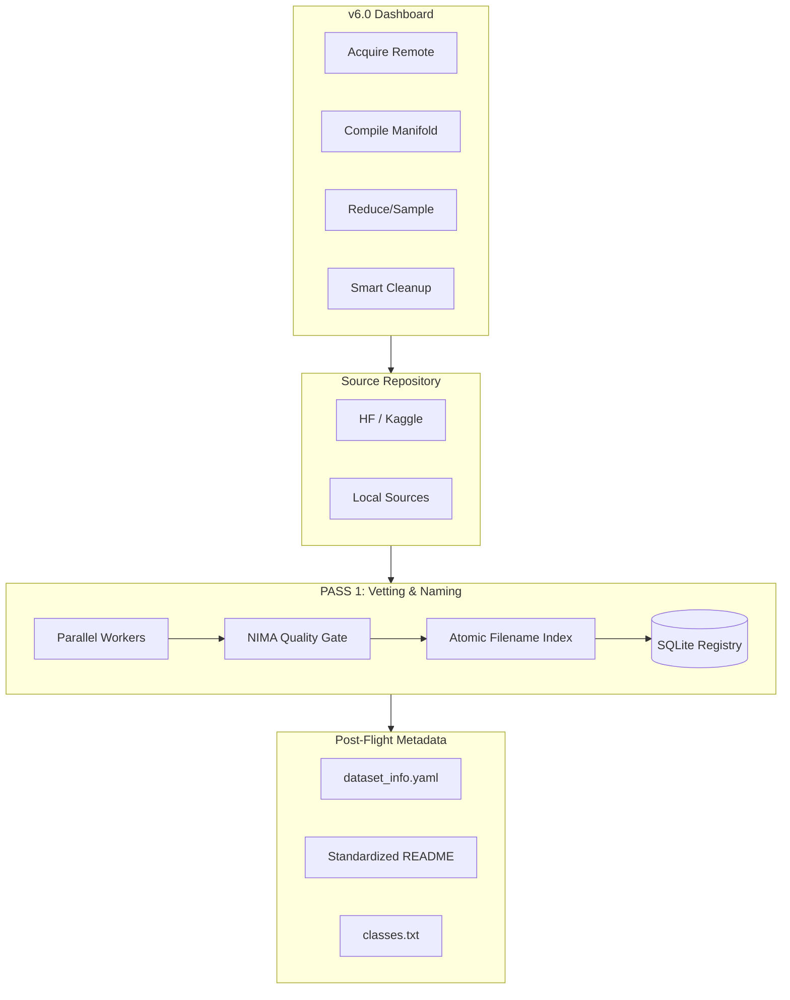

# LemGendary Dataset Pipeline (v16.2.0-NUCLEAR-HARDENED)

> **The Industrial Standard for Generative & Vision Data Synthesis.**
>
> Elevate from static sharding to a **Self-Optimizing Generative Manifold**. Orchestrate massive-scale Diffusion and YOLO datasets with industrial-grade CLIP styling, multi-domain balancing, interactive dynamic compilation, and high-velocity **Nuclear-Hardened v16.2** performance.

---

## ⚡ v16.2 SOTA Tier: Nuclear Performance & Resilience

The v16.2 release introduces the **Nuclear-Hardened Compiler**, optimized for processing 1.4M+ item manifolds with zero IPC overhead and O(1) traversal velocity.

### 🚀 High-Velocity Optimizations
- **O(1) Physical Skip-Indexing**: Transitioned from slow `Path` object traversals to string-based `os.scandir` logic. This enables the compiler to skip already-processed samples with near-zero latency, even on massive 1M+ item manifolds.
- **ThreadPoolExecutor Migration**: Replaced high-latency multiprocessing with a streamlined `ThreadPoolExecutor` model, eliminating IPC serialization bottlenecks and maximizing throughput on NVMe hardware.
- **1.4M Sample Stability**: Hardened the `compiler-pipeline` to handle the absolute scale of the `UpnV2Large` manifold, maintaining absolute parity between physical files and SQLite metadata.

### 🛰️ Hybrid Cloud Deployment
- **KaggleHub Integration**: Automated synchronization of compiled manifolds to Kaggle via the `kagglehub` API, enabling seamless transition from local compilation to cloud-native training.
- **Atomic Manifests**: Auto-generated READMEs and `dataset_info.yaml` packages are optimized for direct upload and model tracking in the LemGendary ecosystem.

### 💎 Multi-Modal & Format Resilience
- **Expanded Format Support**: Native ingestion of **TIFF**, **TIF**, and **BMP** tensors for scientific and satellite restoration tasks.
- **Physical Reality Sync**: New `insta_readme_sync.py` utility bypasses slow DB queries in favor of direct filesystem scanning, ensuring README manifests are always 100% accurate to the stored images.
- **Atomic Persistence**: Buffered SQLite commits (1,000 samples) and improved `KeyboardInterrupt` handling to prevent manifold corruption during mid-run terminations.

### 📄 Professional Source Lineage
Every compiled manifold now automatically generates a professional-grade documentation package:
- **4-Column Composition Tables**: Granular breakdown of every original source, including specific **Train/Val/Total** counts for total transparency.
- **`dataset_info.yaml`**: Full metadata compliance for the LemGendary Training Suite.
- **Kaggle-Ready Manifests**: Auto-generated READMEs optimized for direct upload and model tracking.

---

## 🏗️ v5.7 Synthesis Flow


```mermaid
graph TD
    subgraph Hub[v6.0 Dashboard]
        M1[Acquire Remote]
        M2[Compile Manifold]
        M3[Reduce/Sample]
        M4[Smart Cleanup]
    end

    subgraph RawData[Source Repository]
        D1[HF / Kaggle]
        D2[Local Sources]
    end

    subgraph Pass1[PASS 1: Vetting & Naming]
        A[Parallel Workers]
        B[NIMA Quality Gate]
        C[Atomic Filename Index]
        E[(SQLite Registry)]
        
        A --> B
        B --> C
        C --> E
    end

    subgraph Export[Post-Flight Metadata]
        G[dataset_info.yaml]
        H[Standardized README]
        I[classes.txt]
    end

    Hub --> RawData
    RawData --> Pass1
    Pass1 --> Export
```

---

## 🛠️ Developer Interface

### 1. The Dataset Hub (v6.0.0-SOTA)
Launch the modernized interactive dashboard:
```powershell
./lemgendary_datasets_hub.ps1
```

### 2. Manual Orchestration
The python engine now supports direct CLI hooks for automation:
```bash
python compiler-pipeline.py --model nima_aesthetic --max_gb 50 --suffix Large
python compiler-pipeline.py --workers 16    # Override auto-detected worker cap
python compiler-pipeline.py --no-labeling  # High-Speed Mode (Bypass YOLO)
python compiler-pipeline.py --reduce       # Start sampling engine
```

### 3. Hardware Acceleration & Resilience
- **CUDA Guardian**: Real-time detection of GPU availability in the Hub dashboard.
- **CPU-GUARD**: Automatic detection of massive datasets on CPU-bound systems; triggers "High-Speed Mode" to prevent 100+ hour runs.
- **Adaptive Workers**: Priority-based worker scaling (CLI > config > Auto).

---

## 📂 Industrial Output Topology (Nuclear Architecture)
- `raw-sets/` (Source datasets - Protected by Cleanup Guardian)
- `../LemGendaryDatasets/<name>/images/` (Standard structured folders for Restoration)
- `../LemGendaryDatasets/<name>/parquet/` (Highly compressed pyarrow binaries for Generative)
- `../LemGendaryDatasets/<name>/labels/` (10-bin probability vectors)
- `../LemGendaryDatasets/<name>/dataset_info.yaml` (Suite Metadata)
- `../LemGendaryDatasets/<name>/manifold_registry.db` (Persistent SQLite metadata)
- `../LemGendaryDatasets/<name>/README.md` (Kaggle-Optimized Manifest)

---
**LemGendary AI Suite | Advanced Agentic Coding 2026**
