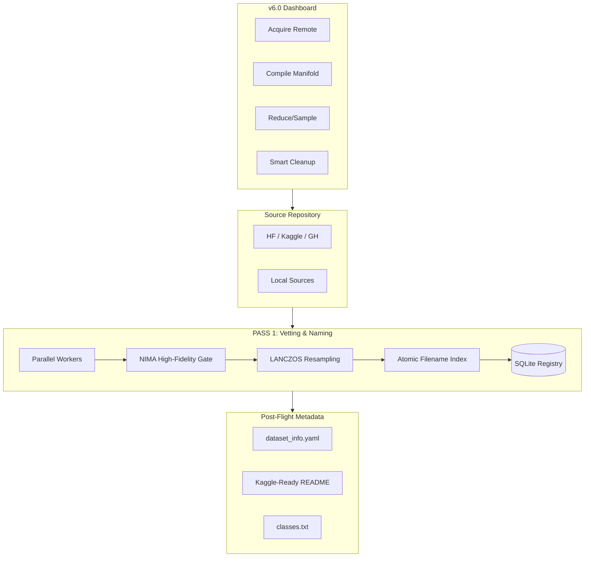

# LemGendary Dataset Pipeline (v16.2.8-NUCLEAR-HARDENED)

> **The Industrial Standard for Generative & Vision Data Synthesis.**
>
> Elevate from static sharding to a **Self-Optimizing Generative Manifold**. Orchestrate massive-scale Diffusion and Vision datasets with industrial-grade CLIP styling, multi-domain balancing, and high-fidelity **LANCZOS** interpolation.

---

## 📡 Mission Status: v16.2.8 (High-Fidelity Synthesis)

🚀 **Status**: High-Fidelity Compilation Active / 1.4M Manifold Stability Verified  
🧪 **Current Goal**: Transition all restoration and generative manifolds to the **LANCZOS-512 Hardened Baseline**.

---

## ⚡ v16.2.8 SOTA Tier: Nuclear Performance & Fidelity

The v16.2.8 release introduces the **High-Fidelity Compiler**, optimized for processing 1.4M+ item manifolds while maintaining absolute structural integrity for restoration tasks.

### 🚀 High-Velocity Optimizations

- **O(1) Physical Skip-Indexing**: Transitioned from slow recursive traversals to string-based `os.scandir` logic. The compiler skips already-processed samples with near-zero latency, even on massive 1M+ item manifolds.
- **LANCZOS High-Fidelity Scaling**: Native integration of Lanczos resampling for all resolution-locked tasks (Diffusion/VLM), ensuring zero feature aliasing during the downsampling phase.
- **High-Fidelity Floor (v16.2.8)**: Mandatory resolution filtering to prevent low-res "blur" pathologies.
  - **Quality & Diffusion**: Enforced **512px** minimum floor.
  - **Restoration & SR**: Enforced **224px** minimum floor.
- **ThreadPoolExecutor Zero-IPC**: Streamlined execution model that eliminates Windows IPC serialization bottlenecks, maximizing throughput on high-speed NVMe hardware.
- **1024px SOTA Baselines**: Standardized diffusion manifold resolution to 1024px for native SDXL/Flux compatibility.

### 🛰️ Hybrid Cloud & Registry Integration

- **Atomic Registry Resumption**: Integrated SQLite-based checkpoints allow for instantaneous resumption of interrupted 1M-sample runs without redundant I/O.
- **KaggleHub & HF Sync**: Automated synchronization of compiled manifolds to Kaggle/HF via native API managers (`kaggle_manager.py`, `hf_manager.py`).
- **Standardized `dataset_info.yaml`**: Every manifold generates a suite-compliant metadata package for immediate ingestion by the LemGendary Training Suite.
- **UPNv2 Large Space-Recovery (v16.2.9)**: Autonomously purged **1.36 million empty labels** and compiled physical **NTFS hardlinks** in `targets/` mapping back to `images/` on duplicate synthetic structures, successfully recovering **~1.06 TB** of disk space with zero pipeline disruption.

### 💎 Multi-Modal & Format Resilience

- **Parquet & Safetensors Support**: Native ingestion of highly compressed pyarrow binaries and model metadata (Kohya/Civitai tags).
- **DPED Mirroring v2.1**: Automated alignment of synthetic and real-world restoration pairs (Smartphone vs. Canon) using the specialized DPED cache.
- **VRAM De-fragmentation**: Proactive memory purging during NIMA/YOLO vetting to prevent OOM on 4GB-8GB local hardware.
- **Universal Film Restorer Dataset Hardening**: Confirmed exactly **0 empty label files** and **100% target physical hardlinking** in `LemGendizedFilmRestorerLarge`, guaranteeing a pristine production state at 0 bytes disk overhead.
- **Professional Multi-Task Restoration Dataset Integration (v16.2.9)**: Structured unified source pipeline merging 11 individual manifolds (deblurring, denoising, deraining, low-light, ffanet, and ultrazoom). Standardized target hardlinking layout with case-insensitive physically skip-indexed ingestion, and configured strict Lanczos/interpolation ceilings at 256px-640px to feed the Mixture-of-Experts (MoE) routing engine.

---

## 🏗️ v6.2 Synthesis Flow


```mermaid
graph TD
    subgraph Hub[v6.0 Dashboard]
        M1[Acquire Remote]
        M2[Compile Manifold]
        M3[Reduce/Sample]
        M4[Smart Cleanup]
    end

    subgraph RawData[Source Repository]
        D1[HF / Kaggle / GH]
        D2[Local Sources]
    end

    subgraph Pass1[PASS 1: Vetting & Naming]
        A[Parallel Workers]
        B[NIMA High-Fidelity Gate]
        C[LANCZOS Resampling]
        D[Atomic Filename Index]
        E[(SQLite Registry)]
        
        A --> B
        B --> C
        C --> D
        D --> E
    end

    subgraph Export[Post-Flight Metadata]
        G[dataset_info.yaml]
        H[Kaggle-Ready README]
        I[classes.txt]
    end

    Hub --> RawData
    RawData --> Pass1
    Pass1 --> Export
```

---

## 🛠️ Developer Interface

### 1. The Dataset Hub (v6.0.0-SOTA)

The modernized interactive dashboard for end-to-end manifold management:

```powershell
./lemgendary_datasets_hub.ps1
```

### 2. Manual Orchestration

The python engine supports direct CLI hooks for automation:

```bash
python compiler-pipeline.py --model nima_aesthetic --max_gb 50 --suffix Large
python compiler-pipeline.py --workers 16    # Override auto-detected worker cap
python compiler-pipeline.py --no-labeling  # High-Speed Mode (Bypass YOLO)
python compiler-pipeline.py --no-hash      # Zero-Latency Mode (Bypass Dedup)
```

### 3. Hardware Acceleration & Resilience

- **CPU-GUARD**: Automatic detection of massive datasets on CPU-bound systems; triggers "High-Speed Mode" to prevent I/O thrashing.
- **CUDA-Sentry**: Real-time detection of GPU availability for NIMA vetting and YOLO auto-labeling.

---

## 📂 Industrial Output Topology (Nuclear Architecture)

- `raw-sets/` (Source datasets - Protected by Cleanup Guardian)
- `../LemGendaryDatasets/<name>/images/` (Standard structured folders for Restoration)
- `../LemGendaryDatasets/<name>/labels/` (NIMA 10-bin probabilities or YOLO vectors)
- `../LemGendaryDatasets/<name>/targets/` (Ground truth targets for SR/Restoration)
- `../LemGendaryDatasets/<name>/dataset_info.yaml` (Suite Metadata)
- `../LemGendaryDatasets/<name>/manifold_registry.db` (Persistent SQLite metadata)
- `../LemGendaryDatasets/<name>/README.md` (Kaggle-Optimized Manifest)

---

<p align="center"><sub>LemGendary AI Suite | Advanced Agentic Coding 2026</sub></p>
