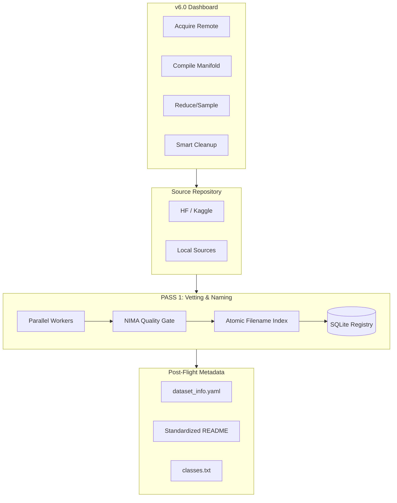

# LemGendary Dataset Pipeline (v6.1.0-Resilience)

> **The Industrial Standard for Generative & Vision Data Synthesis.**
>
> Elevate from static sharding to a **Self-Optimizing Generative Manifold**. Orchestrate massive-scale Diffusion and YOLO datasets with industrial-grade CLIP styling, multi-domain balancing, interactive dynamic compilation, and SQLite persistence.

---

## ⚡ v6.0 SOTA Tier: Multi-Tenant Generative Orchestration

The v6.0 release transforms the pipeline into a complete **Dataset Lifecycle Manager**, adding Parquet generative formatting, root-level multi-tenant architecture decoupling, and strict metadata compliance for the LemGendary Training Suite.

### 🎯 Interactive Orchestrator Dashboard
- **Row-Based Navigation**: A modernized, high-density CLI menu in both Python and PowerShell.
- **[ACQUIRE] Logic**: Automated pulling of remote sources from Hugging Face and Kaggle directly into the `raw-sets/` buffer.
- **[REDUCE] Engine**: Instantly create downsampled "Mini" or "Targeted" manifold variants from existing compiled datasets.
- **[CLEANUP] Guardian**: A smart deletion engine that verifies `unified_data.yaml` dependencies before purging raw sources.
- **[BOOTSTRAP] Self-Healing**: Automated environment setup that detects missing `.venv` or broken CUDA installations and offers one-click repairs.

### 💎 Multi-Modal Generative Support (v6.0)
- **Parquet Streaming**: Diffusion and Vision-Language (VLM) datasets are natively packed into highly compressed PyArrow `.parquet` binaries.
- **Classification Engine**: The compiler natively scans dataset repositories and automatically assigns categorical integer tags based on path heuristics (e.g., DeepFake `FAKE` vs `REAL` logic) for the Authenticity Scorer.
- **Multimodal Attributes**: Standardized schemas support `image_bytes`, textual `prompt` embedding, `aesthetic_score` binning, and multimodal `conversation` dicts.
- **Atomic Persistence**: Registry commits are now buffered every 1,000 samples to prevent SQLite journal bloat and stabilize I/O on large manifolds.

### 📄 Universal Metadata Compliance
Every compiled manifold now automatically generates a full LemGendary-compliant metadata package:
- **`dataset_info.yaml`**: Detailed stats, task type (Restoration vs. Generative), and source provenance.
- **`category.txt` / `classes.txt`**: Standardized taxonomies for immediate training ingestion.
- **SOTA README**: Auto-generated dataset manifests specifically configured for Kaggle sync and Parquet tracking.

---

## 🏗️ v5.7 Synthesis Flow


```mermaid
graph TD
    subgraph Hub[v6.0 Dashboard]
        M1[Acquire Remote]
        M2[Compile Manifold]
        M3[Reduce/Sample]
        M4[Smart Cleanup]
    end

    subgraph RawData[Source Repository]
        D1[HF / Kaggle]
        D2[Local Sources]
    end

    subgraph Pass1[PASS 1: Vetting & Naming]
        A[Parallel Workers]
        B[NIMA Quality Gate]
        C[Atomic Filename Index]
        E[(SQLite Registry)]
        
        A --> B
        B --> C
        C --> E
    end

    subgraph Export[Post-Flight Metadata]
        G[dataset_info.yaml]
        H[Standardized README]
        I[classes.txt]
    end

    Hub --> RawData
    RawData --> Pass1
    Pass1 --> Export
```

---

## 🛠️ Developer Interface

### 1. The Dataset Hub (v6.0.0-SOTA)
Launch the modernized interactive dashboard:
```powershell
./lemgendary_datasets_hub.ps1
```

### 2. Manual Orchestration
The python engine now supports direct CLI hooks for automation:
```bash
python compiler-pipeline.py --model nima_aesthetic --max_gb 50 --suffix Large
python compiler-pipeline.py --workers 16    # Override auto-detected worker cap
python compiler-pipeline.py --no-labeling  # High-Speed Mode (Bypass YOLO)
python compiler-pipeline.py --reduce       # Start sampling engine
```

### 3. Hardware Acceleration & Resilience
- **CUDA Guardian**: Real-time detection of GPU availability in the Hub dashboard.
- **CPU-GUARD**: Automatic detection of massive datasets on CPU-bound systems; triggers "High-Speed Mode" to prevent 100+ hour runs.
- **Adaptive Workers**: Priority-based worker scaling (CLI > config > Auto).

---

## 📂 Industrial Output Topology (Decoupled Architecture)
- `raw-sets/` (Source datasets - Protected by Cleanup Guardian)
- `../LemGendaryDatasets/<name>/images/` (Standard structured folders for Restoration)
- `../LemGendaryDatasets/<name>/parquet/` (Highly compressed pyarrow binaries for Generative)
- `../LemGendaryDatasets/<name>/labels/` (10-bin probability vectors)
- `../LemGendaryDatasets/<name>/dataset_info.yaml` (Suite Metadata)
- `../LemGendaryDatasets/<name>/manifold_registry.db` (Persistent SQLite metadata)

---
**LemGendary AI Suite | Advanced Agentic Coding 2026**
